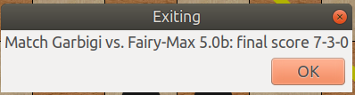
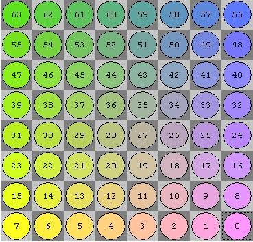
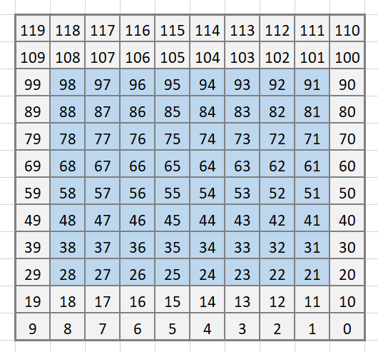

  Inainte de toate am ales Java pentru familiaritate si pentru usurinta de 
a folosi un limbaj orientat pe obiect intr-un proiect asa de mare.

Despre etapa 3...
======
  Pentru etapa asta nu am facut maaare lucru, dar am rezolvat multe bug-uri care
ne trageau in spate etapa trecuta. Din fericire, am adaugat multe optimizari inca
din etapa 2, iar acum, printre picaturi, teme si teste, le-am facut sa mearga cat
de cat ok.
  Am adaugat (sau rezolvat mai bine zis) diverse euristici pt eval.
  Din pacate, aparent joaca cu mult mai bine pe alb, si sincer nu stiu de ce. Ne-am
uitat peste tot codul si nu am gasit vreun "motiv", asa ca putem doar sa spunem
"aia e, atat s-a putut" si sa speram ca totusi se descurca indeajuns de bine.
  Ca o nota de incheiere, ideea proiectului a fost frumoasa, si, desi speram sa
se organizeze etapele mai bine, am reusit sa scoatem ceva functional.
  Cu siguranta cand o sa avem timp la vara, o sa continuam sa lucram la el. E pacat
de munca noastra sa o lasam intr-o stare de care nu suntem 100% multumiti.
  PS: scuze de coding style, nu am avut timp sa il facem calumea =))

Despre etapa 2...
======

  Din pacate, doar in stadiul asta am putut ajunge dupa un maraton de codat de
24+ ore (am si pierdut notiunea timpului). It's far from perfect, dar vom 
continua ce am inceput pentru etapa urmatoare.

  Am incercat cat de bine am putut sa implementam minmax cu alfa beta insa fara 
o functie de evaluare foarte buna nu prea avem cum sa-l batem pe Fairy in 
fiecare meci. 
  A fost destul de complicat, desi aveam optimizari pentru performanta, care 
ating un depth destul de mare intr-un timp destul de scurt. Cu toate temele din 
perioada asta, sarbatorile, trecutul pe online si restul incarcarilor
suplimentare de la alte materii, nu am reusit decat sa scoatem bugurile, 
deoarece am implementat atatea chestii noi in atat de putin timp si nu am apucat
sa le testam calumea, cum am fi vrut noi (incat sa duca la un outcome constant).

  In general, sunt generate toate miscarile valide, dar sincer, orice functie de 
evaluare are nevoie de fine-tuning in urma rularii multor meciuri, engine-ul
nostru nu prea stie ce sa faca cu valorile, nu i-am dat inca "un scop". In
momentul actual, stie doar sa pozitioneze piese cat de cat bine si, desigur, sa
faca trade-uri in favoarea lui (desi deseori, maximul local nu e si cel 
global :D)

  Oricum in general, o functie de search e relativ usoara. Generarea de mutari e
cancer si, in opinia noastra ar fi trebuit sa fie punctul de interes al etapei, 
poate cu testare cu Perft sau divide pentru verificare de validitate. Abia dupa
etapa care s-ar fi ocupat cu generarea de miscari (valide), ar fi urmat 
evaluarea...
Functia de search (mai ales ca este scrisa direct cu alfa beta) se face cel mai 
rapid, cel putin din punctul nostru de vedere.
 
  Punem si o poza cu unul din rezultatele cu Fairy. Nu garantam ca rularea de 
mai multe ori poate duce la acelasi rezultat, pentru ca meciurile nu sunt
intocmai "previzibile". Desi am gasit o oarecare (mare) inconsistenta intre
rulari, as zice ca poza ar descrie media rezultatelor la care am ajuns (putin
optimista desigur :D), cel putin inainte sa, sincer, incercam toate
"fine tuning"-urile la ochi, din lipsa de timp.



Reprezentarea interna a starilor
======

Am pornit de la idea ca vom reprezenta harta de sah cu numere pe 64 de biti
numite Biboards. Intern avem un numar de 12 bitboard-uri pentru fiecare tip
de piese (alb sau negru) si cateva bitboarduri helpere cum ar fi toate piesele
albe sau toate piesele negre. Fiecare bitboard are o valoare (int in care se
stocheaza valoarea piesei fata de un pion), un numar de piese (in care se
stocheaza cate piese de acel tip mai sunt pe tabla) si reprezentare 
(reprezentarea propriu-zisa care este un long pe 64 de biti, ce are in locul
in care ar fi o piese un bit setat ca 1). De exemplu la inceputul jocului
bitboardurile pentru pioni albi, pioni negri, toate piesele albe si toate
piesele negre arata asa:

```
pioni albi	    pioni negru    	toate piesele albe  toate negre
. . . . . . . .     . . . . . . . .     . . . . . . . .     # # # # # # # # 
. . . . . . . .     # # # # # # # #     . . . . . . . .     # # # # # # # # 
. . . . . . . .     . . . . . . . .     . . . . . . . .     . . . . . . . .
. . . . . . . .     . . . . . . . .     . . . . . . . .     . . . . . . . .
. . . . . . . .     . . . . . . . .     . . . . . . . .     . . . . . . . .
. . . . . . . .     . . . . . . . .     . . . . . . . .     . . . . . . . .
# # # # # # # #     . . . . . . . .     # # # # # # # #     . . . . . . . .
. . . . . . . .     . . . . . . . .     # # # # # # # #     . . . . . . . .
```
Reprezentarea interna a mutarilor
======
- In total 4 nibbles pentru a codifica o mutare. En passant se seteaza cand se poate captura un pion en passant.
```
mutare:
	0000 0000 0011 1111 sursa (2^6 64 de valori, de la 0 la 63)
	0000 1111 1100 0000 destinatie (2^6 64 de valori, de la 0 la 63)
	0011 0000 0000 0000 promotie (4 valori - cal 0 (00), nebun 01 (01), tura (10), regina (11))
	1100 0000 0000 0000 flag (4 valori - promotie 1 (01), en passant 2 (10), castling 3 (11))
 ``` 
 
Indexarile interne
======
 - Avem 2 tipuri de indexari, una normala, pe 64 de pozitii, care reprezinta 1:1
tabla de joc, si una pe 120 de pozitii, care ne ajuta la bounds checking (sa nu
iasa piesele de pe un perete si sa intre pe altul)





Operatiile cu bitboardurile
======

 - Biti sunt setati la 1 sau la 0 in O(1) folosing masti pentru clear si masti
pentru set care sunt matrice pline cu 1 sau pline cu 0.
 - Un array de 120 si respectiv 64 de valori de la 1 la 120 si de la 1 la 64.
 Acestea vor fi folosite pentru bounds checking in urmatoarele etape ale 
 proiectului.
 - BoardStateul este un Singleton care este accesat global in metodele care au
nevoie de el pentru simplitate si pentru faptul ca o sa avem un singur 
BoardState la o rulare a unui meci de sah.
 - Bitboard-urile sunt generate din FEN-uri (notatii standard pentru sah), 
putem introduce orice FEN la functia init game si se va porni jocul dintr-o 
pozitie predefinita de FEN. Daca functia nu este apelata cu FEN aceasta va
folosi FEN-ul care codifica inceputul meciului:

<p align="center">
<code>
rnbqkbnr/pppppppp/8/8/8/8/PPPPPPPP/RNBQKBNR w KQkq - 0 1 *
</code>
</p>

Magic bitboards
======
O zi intreaga am stat pe mizeria asta ca sa generez miscari pentru sliding pieces in O(1).
E magie neagra, nu incercati sa intelegeti pentru ca o sa muriti. Anyway, hai sa le intelegem.
In loc sa fac varianta clasica de fraieri in care generez miscari pentru piesele care fac
"slide" (regina, nebun, tura) verificand fiecare patrat, eu folosesc un hashTable cu valorile
deja calculate in care doar iau pozitia turei/nebunului/reginei si un bitboard care este
bitboard blocant, adica unde nu poate sa mearga piesa si intorc direct unde poate sa se miste
piesa. AMAZING, right?

Noi folosim de aici versiunea plain. 
https://www.chessprogramming.org/Magic_Bitboards

Am urmat in mare parte wiki-ul si am gasit pseudocod pe site-uri vechi de zeci de ani pentru 
metoda asta. Nu prea a fost la indemana dar ar trebui sa fie undeva la un 200% performance boost.

Parsarea si interpretarea comenzilor
======

 - Comenzile sunt citite de la stdin intr-un loop infinit, singurul break
este atunci cand programul da quit.
 - Comenzile sunt implementate dupa documentatia de pe site-ul xboard-ului si
fac ce ar trebui ele sa faca intuitiv (white seteaza engine-ul ca white,
new incepe un joc nou, etc).
 - Clasa Database este un singleton este o clasa in care avem stocate 
informatii si metode care nu tin de starea pieselor ci de starea jocului(cine 
e la mutare, cate mutari s-au facut, cine urmeaza sa mute, ce culoare joaca
engine-ul etc.)

Feature
======

 - usermove = 0, pentru a fi mai usor de parsat usermove
 - sigterm si sigint sunt pentru ca xboard sa nu ne crape programul cu semnale
 - reuse = 0, xboard deschide o instanta noua a programului la fiecare new (
 probabil nu o sa folosim reuse in build-ul final)
 - time = 0, urmeaza sa fie implementat, momentan nu avem treaba cu timpul
 
Build and run
======
 - xboard -fcp "java -jar hopefully.jar" -debug -nameOfDebugFile "plm.txt" (pentru noi cand suntem prosti si uitam)
 - make build (pentru a crea jar-ul si a compila codul sursa)
 - xboard -cp -fcp "make run" (pentru a rula xboard cu enginul nostru)
 - make clean pentru a sterge jar-ul si pentru a putea recompila sursele
